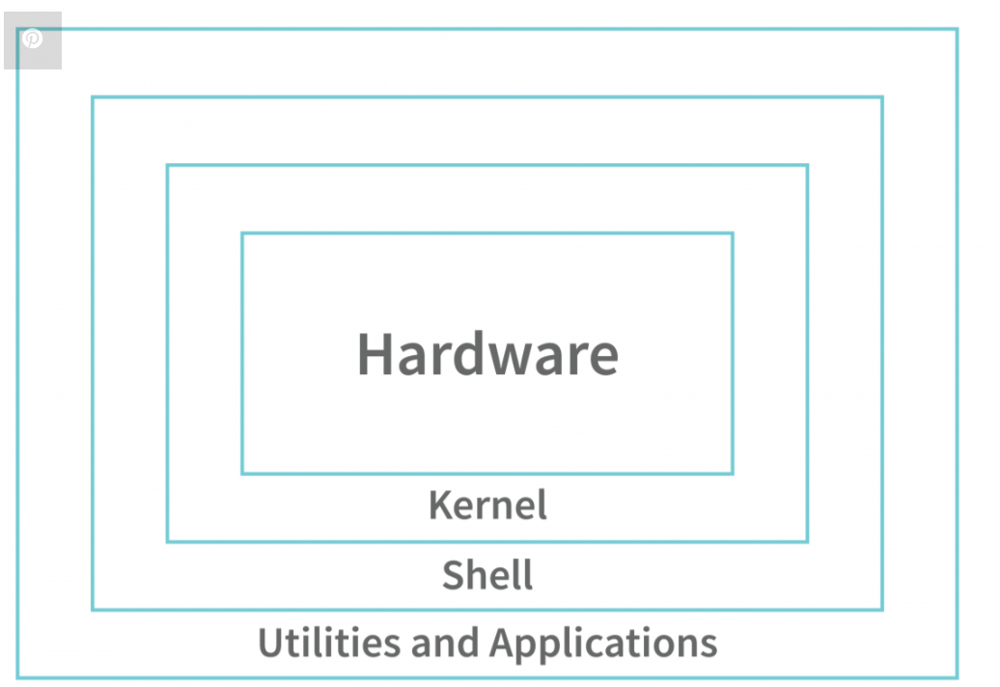

# Unix Architecture

Ken Thompson, Dennis Ritchie, and their team developed an Operating System called Unix (Uniplexed Information Computing System) in 1970 in the AT&T laboratory. So, Unix dates from 1970 and it is pretty old. However, most of us might not have used Unix in our lives. The reason is pretty simple. Unix was developed for the programmers/software developers to build software. It was not initially created for use by the common public.
However, from Unix, we got many other Operating Systems like Ubuntu, Solaris, etc. These operating systems are also used more commonly by the public, especially Ubuntu. So, it becomes important and interesting to know about the architecture of the Unix Operating System as it is the architecture that helps the Unix Operating System be efficient for software developers and also helps in building other Operating Systems.
In this article, we will understand the Unix Architecture, Features of Unix, and advantages of Unix Architecture in detail. So, let’s get started.

## What is the Unix Operating System?
Well, we know that Unix is an Operating System. Like any other Operating System, Unix also acts as an interface between the user and the hardware, i.e. the user and the computer itself. Unix mainly focuses on the concept of Kernel and Shell division of an Operating System due to which it is so powerful.

Kernel: The kernel is a program in the Operating System software that keeps on running in the background when the machine is on and it is responsible for allocating the resources to the processes, handling and coordinating the multiple processes running together.
Shell: However, since the kernel is such an essential program in the Operating System and performs almost all of the major tasks, it should not be directly accessible to the user. So, there is a program between the user and the kernel that helps the user interact with the kernel. This program is called the shell.

## Features of Unix Operating System
Following are the features of the Unix operating system that date from the very first version to the latest versions of Unix:

- Multitasking Operating System:  In Unix, a user can run multiple tasks/processes simultaneously. For example, a user can run a text editor and can also open a web browser at the same time. However, it is important to note that “multitasking” is not what actually happens behind the scenes. The Unix operating system can only execute one process at a time. However, multiple processes are brought into the main memory and context switching happens in the main memory. This means that a process executes only for a fixed interval of time (called the time quantum) and after it has executed that many units of time, it gets removed and some other process executes. Now, this process will also execute for quantum time, and then it will also get switched by some other process. So, the turn of the first process will come again and it will execute from where it left. This happens so fast that it creates an illusion of multitasking, i.e. multiple processes being run at the same time. This multitasking feature can also be seen in Windows OS.

- Multiuser Operating System: In Unix, multiple users can run their own tasks/processes simultaneously. Hence, Unix is called a multiuser OS. However, the case is the same as multitasking. Each user executes his/her own process for quantum units of time and then the process gets context switched and the other user’s process starts executing. Then, after some time, the first user’s process will again be executed from where it left. This happens really fast and creates an illusion of a multiuser operating system.

- Small Commands and Pipelining: The Unix is a programmer-friendly software as it relies more on the commands rather than GUI (Graphical User Interface). To provide convenience to the programmers, UNIX has a small command for every small task we do in Unix. For example, the ls command is used to list all the files and directories inside the current directory in which we are working. Another example is the wc command, which is used to count words and bytes for files. Pipelining of commands is a concept of connecting multiple small commands using a pipe “ | ” symbol to perform complex instructions. For example, the above 2 commands can be pipelined as “$ ls | wc”. This command can count the number of files in the directory.

- The Powerful Unix Toolkit: Unix has a toolkit, that is, it has multiple applications that help in performing multiple tasks. For example, Unix has compilers and interpreters, text manipulation tools, system administration tools, etc. Whenever a new version of Unix is released, some of the old programs/applications are either modified or removed from the toolkit and some new applications are added.

So, these were some of the topmost features of the Unix Operating System. Apart from this, the ease of programming in Unix because of the above features and the amazing Unix documentation helps increase its power more. Now that we have some basic idea about Unix and its features, let us learn about Unix Architecture.

## Unix Architecture
Have a look at the image shown below:

Unix Architecture Layers
The Unix architecture has 4 layers. These layers are as shown below:

__Hardware:__ Hardware is the most simple and least powerful layer in the Unix Architecture. Hardware is the components that are humanly visible. Whatever hardware is connected to a Unix operating system-based machine, comes in the hardware layer.

__Kernel:__ This is the most powerful layer of the Unix architecture. The kernel is responsible for acting as an interface between the user and the hardware for the effective utilization of the hardware. The kernel handles the hardware effectively by using the device drivers. The kernel is also responsible for process management. So, the main 2 features of the kernel are process management and file management.

__Process Management:__ The processes that execute within the operating system require a lot of management in terms of memory being allocated to them, the resource allocation to the process, process synchronization, etc. All this is done by the Kernel in Unix OS. This is done using various Operating System Techniques like paging, framing, virtual memory, swapping, context-switching, etc.

__File Management:__ File management involves managing the data stored in the files. This also includes the transmission of data stored in these files to the processes as and when they request it.

__Shell:__ We understood the importance of the kernel and that it handles most of the important and complex tasks of Unix OS. Since the kernel is such an important program of the Unix Operating System, its direct access to the users can be dangerous. Hence, the Shell comes into the picture. Shell is an interpreter program that interprets the commands entered by the user and then sends the requests to the kernel to execute those commands. When the execution of the process is completed, the shell again sends a request to the kernel to display the program/information on the screen to the user. So, Kernel is an interface between the user and the hardware and the Shell is an interface between the user and the Kernel. The shell can be used for opening a file, writing into the files, executing programs, etc. 

There are 3 types of shells in the Unix Operating system.

- __Unix shell
Bourne Shell (sh):__ It is the most widely available shell on Unix OS devices across the world. This was the first shell available in the Unix OS. It is simply called a shell.
- __C Shell (csh):__ The University of California (Berkeley) developed C Shell is another Unix shell that removes some of the obsolete features or problems from the Bourne Shell. So, it enhances the performance of the Bourne Shell.

- __Korn Shell (ksh):__ The name of the Korn Shell is based on its creator, David Korn. This shell enhances the C shell further by removing the shortcomings of the C shell and also enhancing the user interaction of the Bourne Shell.
Applications/Application Programs: The last layer of the Unix architecture is the Application Program layer. As the name suggests, this outermost layer of Unix Architecture is responsible for executing the application programs.

Types of Unix

Solaris
Darwin
Mac-OS
IBM AIX
HP-UX
Now that we have understood the complete architecture of Unix OS, let us understand some of the advantages of Unix OS.

# Advantages of Unix OS
- __Less Memory Usage:__ The kernel is responsible for process management and it manages the processes in such an efficient manner that Unix programs use less memory while running.

- __Safe and Secure:__ The kernel is an interface between the user and the hardware and the Shell is an interface between the user and the kernel. So, there is no way a user can interact directly with the hardware or the kernel. Hence, Unix is highly secure. Also, Unix and Unix-based OS are considered safe from viruses. Hence, there is no need to install any external anti-virus software in Unix OS.

- __Portable:__ Unix is portable. This means that Unix can be installed on any computer or laptop. This is because it is developed using C language and C language is a high-performing and highly portable programming language.

- __Multitasking and Multiuser:__ We have talked about this feature of Unix OS and it is very important in today’s world where time is everything and the OS executing multiple programs saves time. However, we have discussed the concept of context-switching using which this illusion of multitasking and multiuser is created.
So, these were some of the advantages of the Unix OS.

Article Link: https://www.interviewbit.com/blog/unix-architecture/

# What are the similarities and differences between Unix and Linux?

__Similarities:__

Both Unix and Linux are multitasking, multiuser operating systems with a similar design philosophy.
They share a hierarchical file system structure and many common command-line utilities (like ls, grep, and awk).
They support similar shells (Bash, sh) and development tools, making transitioning between them relatively smooth for users familiar with one.

__Differences:__

Origin & Licensing:
Unix is a family of operating systems originally developed in the 1970s, mostly proprietary (e.g., AIX, HP-UX, Solaris).
Linux is a Unix-like operating system kernel developed in 1991 by Linus Torvalds and is open source, available under the GNU General Public License (GPL).

Development & Customization:
Linux has evolved through contributions from a global community, leading to a variety of distributions tailored for different needs.
Unix systems are generally developed and maintained by specific vendors, often with less flexibility for customization.

Market Usage:
Linux is widely used in servers, cloud computing, and embedded systems due to its cost-effectiveness and flexibility.
Unix systems are commonly found in legacy enterprise environments where stability and vendor support are paramount.
In essence, while Linux is inspired by Unix and shares many of its features, it has grown into its own ecosystem with a focus on open-source development and widespread adaptability.

Linux supports multiple shells much like Unix. While most Linux distributions default to Bash (Bourne Again Shell), which is an enhanced version of the traditional Bourne shell (sh), you can also install and use other shells like C Shell (csh) and Korn Shell (ksh). Additionally, many distributions offer even more options, such as Z Shell (zsh), giving you the flexibility to choose the shell that best fits your workflow.

# Differences between Bash, sh, csh, ksh, zsh

Bourne Shell (sh)

Origin: One of the earliest Unix shells, developed by Stephen Bourne.
Features:
Minimal and straightforward.
Provides basic control structures (loops, conditionals) and scripting capabilities.
Usage:
Often used for writing simple shell scripts or when maximum portability is required (POSIX compliant).

Bourne-Again Shell (Bash)

Origin: An enhanced replacement for sh, developed as part of the GNU Project.
Features:
Retains compatibility with sh while adding features like command-line editing, improved scripting syntax, arrays, and functions.
Provides job control, command history, and advanced string manipulation.
Usage:
Default shell on most Linux distributions.
Widely used for both interactive use and scripting due to its rich feature set.

C Shell (csh)

Origin: Developed by Bill Joy; its syntax borrows from the C programming language.
Features:
C-like syntax, which can make interactive use feel familiar to C programmers.
Built-in command history and aliasing.
Limitations:
Its scripting capabilities are less robust and more error-prone compared to Bourne-derived shells.
Often considered less suitable for serious scripting work.

Korn Shell (ksh)

Origin: Developed by David Korn, designed to be backward-compatible with sh while offering enhancements.
Features:
Combines the best features of sh with improvements such as command-line editing, more powerful scripting capabilities, and built-in arithmetic.
Offers better performance and more features than sh, with many enhancements later adopted by Bash.
Usage:
Popular in enterprise environments where enhanced scripting features and efficiency are valued.

Z Shell (zsh)

Origin: A more modern shell that builds on features from Bash, ksh, and tcsh.
Features:
Highly customizable, with advanced tab completion, globbing, and a rich plugin/theme ecosystem.
Offers robust interactive features (e.g., improved history management and autosuggestions) and powerful scripting capabilities.
Usage:
Preferred by users who want an interactive, visually appealing, and feature-rich shell experience.
Often used with frameworks like Oh My Zsh for extended functionality.

Summary of Key Differences:
Syntax and Scripting:

sh: Basic and minimal; designed for simplicity and portability.
Bash & ksh: Offer enhanced scripting with additional features and syntax improvements while maintaining sh compatibility.
csh: Uses C-like syntax which is different from the Bourne-derived shells and is less suited for complex scripts.
zsh: Provides a mix of advanced interactive features with robust scripting, often considered the most modern and user-friendly.
Interactive Use:

Bash, ksh, and zsh are all popular for interactive use, with zsh being highly customizable.
csh is less favored for interactive scripting due to its less forgiving syntax and error handling.
Each shell has its strengths, so the best choice depends on your use case—whether it’s for simple scripts, robust interactive use, or highly customized command-line experiences.

# How to check which shells are available for use in Linux and how to switch between them?

You can easily check which shells are available and switch between them:

__1.__ Check Available Shells
List all shells:
Open a terminal and run:

`cat /etc/shells`

This file lists all installed shells on your Linux system.

Check your current shell:
You can see your current shell by running:

`echo $SHELL`

or

`echo $0`

__2.__ Switch Between Shells

Temporary Switch (Session-Based):
Launch another shell:
Simply type the name of the shell you want to use, for example:

`bash`

or

`zsh`

This starts a new shell session. To return to your original shell, type exit.

__3.__ __Permanent Switch (Login Shell):__

Change your default shell using chsh:

Run:

`chsh -s /path/to/shell`

For example, to switch to Z Shell:

`chsh -s /bin/zsh`

You’ll need to log out and log back in for the change to take effect.

Note:
Make sure the shell path you use is one of those listed in /etc/shells.

## In the Linux architecture, between the hardware and the user, kernel acts as the interface. Since kernel is a software that handles very crucial tasks like file management and process management, it should not be directly accessible to the user for safety reasons, hence shells come into the picture which act as a interface between the user and the kernel. There are various types of shell available for Unix based OS (for eg: Linux abd MacOS) --> sh, bash, csh, ksh, zsh etc. Discuss about the Windows OS in the similar way.

Windows, like Unix-based systems, is built on a layered architecture where the kernel manages critical system resources while user interfaces provide access to those functionalities. However, the design and user interaction differ from Unix.

### Windows Architecture Overview:
__Hardware and HAL:__
At the lowest level, Windows uses a Hardware Abstraction Layer (HAL) that abstracts the differences among various hardware devices, ensuring the OS can run on diverse hardware platforms.

__Windows Kernel (NT Kernel):__
The Windows NT kernel manages processes, memory, file systems, and device drivers, much like the Linux kernel. It operates in privileged mode and is not directly accessible to the user, ensuring system stability and security.

__Executive and System Services:__
On top of the kernel, Windows has a series of executive services and subsystems (like the I/O Manager and Security Reference Monitor) that coordinate system tasks and expose functionality to user-mode processes.

__User-Mode and Windows API:__
User applications interact with the system through the Windows API (Win32, .NET, etc.), which acts as an intermediary between the applications and the kernel. This is similar in concept to Unix libraries and system calls that abstract kernel services.

---

### User Interfaces (The "Shell" in Windows):

__Graphical Shell (Explorer.exe):__

Windows primarily uses a graphical shell—Windows Explorer—as its user interface. Explorer.exe manages the desktop, taskbar, and file browsing, providing users with a visual way to interact with the operating system.

__Command-Line Interfaces:__

In addition to the GUI shell, Windows offers command-line interfaces:

1) **Command Prompt (cmd.exe):** A legacy text-based interface, analogous to traditional Unix shells, though with different command syntax.

2) **Windows PowerShell:** A more powerful and modern shell built on the .NET framework, offering advanced scripting capabilities and system management tools.

---

### Comparison to Unix Shells:

__Unix (Linux/macOS):__
In Unix-like systems, various shells (sh, bash, csh, ksh, zsh) provide both interactive command-line environments and scripting interfaces that serve as the primary means of interacting with the kernel.

__Windows:__
Windows hides the kernel behind a rich API and a graphical user interface (Explorer). While it does provide command-line shells (cmd.exe and PowerShell), these are more recent additions and complement the GUI rather than serving as the sole interface.

---
### Summary:

In essence, Windows also isolates direct kernel access from the user for safety and stability. The kernel handles critical functions, and users interact with the system through:

A graphical shell (Explorer) that provides a desktop environment,
And command-line shells (cmd.exe, PowerShell) for text-based interaction and automation.
This layered approach in Windows mirrors the Unix philosophy—keeping the kernel secure and providing flexible interfaces for user interaction—but implements it through a combination of a rich GUI and modern scripting environments.

---

